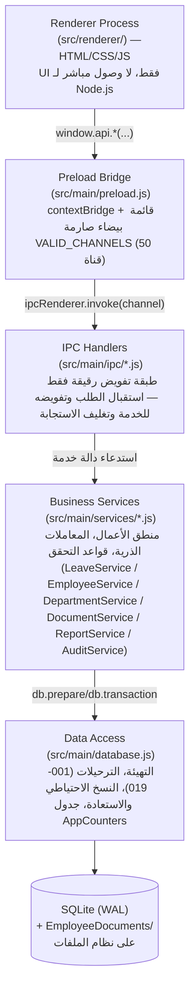
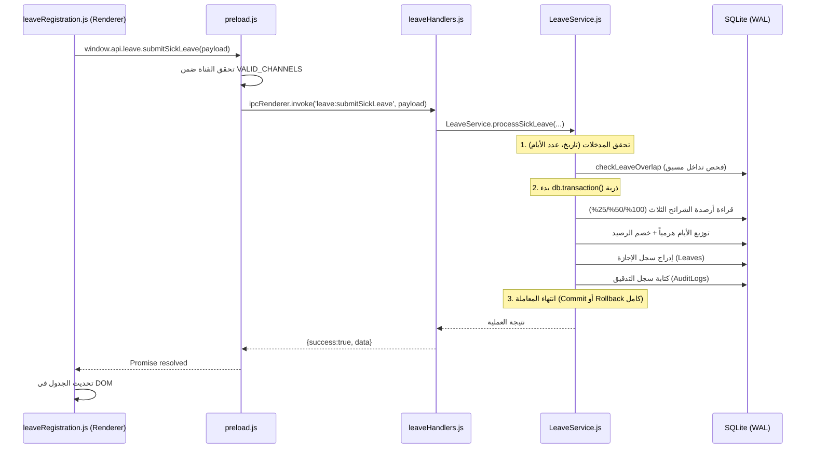
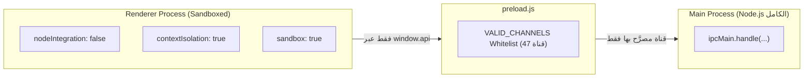

# ARCHITECTURE.md — نظام إدارة الإجازات والمستندات (Holidays)

> **حالة الوثيقة:** توثيق معماري شامل ومحدَّث يطابق الواقع الفعلي للكود بعد اكتمال مراحل التحسين الهندسي (N1, N2, N3, N4) بتاريخ 9 أيلول 2026.
> كل ما ورد هنا مُستخرَج مباشرة من الشيفرة المصدرية المطبقة واختباراتها الآلية.
> عند إجراء أي تعديل بنيوي مستقبلاً، **الكود هو المرجع** — وحدِّث هذا الملف فوراً في نفس الالتزام (Commit).

---

## 1. نظرة عامة (System Overview)

تطبيق سطح مكتب يعمل **Offline بالكامل** لإدارة إجازات ومستندات موظفي دائرة حكومية، مبني على:

| المكوّن | القيمة |
|---|---|
| إطار العمل | Electron `22.3.27` (Chromium 108 / Node.js 16.17.1) |
| المعمارية المدعومة | **64-بت (x64) فقط** (تمهيداً لـ Microsoft Store بموجب ADR-018) |
| قاعدة البيانات | SQLite عبر `better-sqlite3@8.7.0` (إضافة C++ أصلية، نمط WAL) |
| الواجهة | HTML/CSS/JS خام بدون إطار عمل (لا React/Vue) مع خط Cairo مضمّن محلياً |
| نقطة الدخول | `src/main/main.js` |
| التخزين | ملف `leave_management.db` + مجلد `EmployeeDocuments/` على نظام الملفات المحلي |

**لماذا هذا الاختيار:** Electron 22.3.27 هو الإصدار الأكثر استقراراً لدعم بيئات Windows المؤسسية، مع حصر المعمارية على `x64` فقط في `package.json` لتسهيل مسار التغليف والشهادات الرقمية لمتجر مايكروسوفت (Microsoft Store) وتبسيط صيانة الإضافات الأصلية C++ (`better-sqlite3`).

---

## 2. مبدأ البنية العام (Layered Architecture)

النظام مبني على **خمس طبقات صارمة أحادية الاتجاه**، لا يُسمح لأي طبقة بتجاوز الطبقة التي تليها مباشرة:



**القاعدة الحاكمة:** الواجهة (Renderer) **لا تعرف** بوجود `ipcMain` أو `Node.js` أو نظام الملفات إطلاقاً — كل تواصلها يمر حصراً عبر كائن `window.api` المُعرَّف في `preload.js`. هذا مفروض فعلياً عبر `contextIsolation: true` و`nodeIntegration: false` و`sandbox: true` في `src/main/main.js`، وليس مجرد اتفاقية توثيقية.

---

## 3. الطبقات بالتفصيل

### 3.1 طبقة الواجهة — `src/renderer/`

| الملف | المسؤولية |
|---|---|
| `index.html` | الهيكل الموحّد لكل الشاشات (تبويبات + نوافذ حوارية)، بلا Framework — كل التبويبات مُحمَّلة ضمن صفحة واحدة ويُتحكَّم بإظهارها عبر JS |
| `renderer.js` | المحرك الرئيسي — ربط التبويبات وتبديلها |
| `styles.css` | كل الأنماط — يتضمن متغيرات الوضع الفاتح/الداكن |
| `modules/*.js` | وحدة JS مستقلة لكل شاشة وظيفية (مثال: `leaveRegistration.js`، `employeesTab.js`، `dashboardTab.js`، `manageEmployeeTab.js`، `employeeDocumentsModal.js`، `systemSettings.js`، إلخ) |

**نمط ثابت مُلاحَظ في كل وحدات الواجهة:** بيانات المستخدم (أسماء الموظفين، الملاحظات...) تُدرَج في DOM عبر `document.createElement` + `textContent`، وليس عبر تفسير `innerHTML` مباشر للنص القادم من قاعدة البيانات. هذا يقلّص فعلياً مساحة XSS المخزّن رغم كون التطبيق Offline بمدخلات داخلية فقط.

### 3.2 جسر الأمان — `src/main/preload.js`

الملف الوحيد المسموح له بالوصول لكل من `electron` (`contextBridge`, `ipcRenderer`) وبيئة المتصفح (`window`) في آن واحد. يبني كائن `window.api` عبر `contextBridge.exposeInMainWorld('api', {...})`، مقسّماً حسب النطاق الوظيفي: `employees`، `departments`، `leaveTypes`، `leaveBalances`، `leaves`، `leave`، `employee`، `report`، `audit`، `system`، `document`.

**آلية الحماية المحورية:** كل استدعاء يمر عبر دالة `invoke(channel, ...args)` داخلية تتحقق أولاً أن `channel` موجود ضمن `Set` باسم `VALID_CHANNELS` (يحتوي على **50 قناة معتمدة** بعد إضافة قنوات الأقسام وتصدير الإجازات المنتهية) قبل تمريره لـ `ipcRenderer.invoke` — أي قناة غير مُدرَجة تُرفَض فوراً بـ `Promise.reject` دون أن تصل للعملية الرئيسية إطلاقاً.

**🛡️ نمط IPC Channel Guard (`tests/ipcChannelGuard.test.js`):**
وحدة اختبار آلية مدمجة تفحص مطابقة الـ 50 قناة IPC بدقة متناهية:
* تجمع القنوات المسجلة فعلياً في معالجات العملية الرئيسية (`src/main/ipc/*Handlers.js` و `src/main/main.js`).
* تجمع القنوات المسموح بها في القائمة البيضاء (`src/main/preload.js` -> `VALID_CHANNELS`).
* تفحص وجود أي قناة في جهة دون الأخرى، وتفشل عملية الاختبار صراحة عند حدوث أي انحراف، مما يمنع حدوث أخطاء `Channel not allowed` أثناء أي تطوير مستقبلي.

### 3.3 معالجات IPC — `src/main/ipc/*.js` (طبقة تفويض رقيقة فقط — Thin Delegation Layer)

بعد اكتمال N3، أصبحت هذه الطبقة **طبقة تفويض رقيقة بنسبة 100% (Pure Thin Delegation Layer)**. مهمتها الوحيدة استقبال الطلب من الواجهة، تفويضه مباشرة للخدمة المقابلة في `services/`، ثم تغليف الناتج بصيغة موحّدة `{ success: true, data }` أو `{ success: false, error }` عبر دالة مساعدة `safeHandle` (`src/main/utils/ipcHandlerHelper.js`). لا تحتوي أي معالجات IPC على منطق أعمال أو حسابات أرصدة.

الملفات المسؤولة عن توجيه القنوات:
* `employeeHandlers.js`: تفويض حركات الموظفين (إضافة، بحث، تعديل، تفعيل/تجميد، نقل، استعادة، وتتبع التسلسل) إلى `EmployeeService`.
* `departmentHandlers.js`: تفويض عمليات الأقسام (استعلام، إضافة، تعديل، حذف) إلى `DepartmentService`.
* `leaveHandlers.js`: تفويض حركات الإجازات (تسجيل مرضي/اعتيادي، استعلام أرصدة، إجازات نشطة وقادمة، حذف، تعديل) مباشرة وبشكل رقيق إلى `LeaveService`.
* `reportHandlers.js`: تفويض تقارير وتصديرات Excel (السارية والقادمة، المنتهية بـ 16 عموداً، التراكم، الأرصدة الحرجة) إلى `ReportService`.
* `systemHandlers.js`: إدارة النسخ الاحتياطي والاستعادة وإعدادات النظام بالتنسيق مع `database.js`.
* `auditHandlers.js`: استعراض سجلات التدقيق عبر `AuditService`.
* `documentHandlers.js`: أرشفة وطباعة وحذف المستندات عبر `DocumentService`.

### 3.4 طبقة الخدمات (Business Services) — `src/main/services/`

القلب المنطقي للنظام. كل خدمة عديمة الحالة (Stateless) — تستقبل كائن اتصال قاعدة البيانات `db` كوسيط، مما يجعلها قابلة للاختبار المستقل والمعزول بالكامل.

| الخدمة | المسؤولية |
|---|---|
| `LeaveService.js` | محرك احتساب الإجازات: `calculateRegularLeaveBalance`، `processSickLeave`، `processRegularLeave`، `checkLeaveOverlap`، `getActiveLeavesForToday` (سارية وقادمة)، `getExpiredLeaves` (فترات مرنة)، `updateLeave`، `deleteLeave` |
| `EmployeeService.js` | دورة حياة الموظف، إدارة التسلسل التراكمي الثابت عبر `AppCounters`، النقل الخارجي وإلغاء النقل، والتحقق من التكرار |
| `DepartmentService.js` | إدارة هيكل الأقسام، التحقق من عدم تكرار الاسم، وحماية الأقسام المشغولة بموظفين من الحذف |
| `ReportService.js` | بناء تقارير Excel بتنسيق RTL احترافي عبر `exceljs` (كشف الإجازات الحالية والقادمة، كشف الإجازات المنتهية بـ 16 عموداً، تقارير الأرصدة والتراكم، سجل الموظفين، والمستندات) |
| `DocumentService.js` | منطق إدارة مستندات الموظفين (بطاقات الدوام/الإجازات) |
| `DocumentStorageService.js` | التخزين الفيزيائي الآمن للمستندات على القرص، مع تحقق فعلي من احتواء المسار (Path Containment) لمنع اجتياز المسار |
| `AutoBackupService.js` | النسخ الاحتياطي التلقائي الدوري كل 15 يوماً مع تدوير النسخ |
| `AuditService.js` | كتابة وقراءة سجل التدقيق (`AuditLogs`) بشكل موحّد |
| `NotificationService.js` | جدولة تنبيه الإجازات اليومي |
| `LoggerService.js` | تسجيل مركزي موحّد للأخطاء والتحذيرات إلى ملف السجل |

**النموذج الموحّد لمنطق الأعمال الذري (`processSickLeave` / `processRegularLeave`):**
بعد N3، تم توحيد نمط معالجة الإجازات في `LeaveService` بنموذج ذري متسق:
1. **التحقق الاستباقي المسبق (Pre-flight Validation):** التحقق من صحة التواريخ الصارمة (منع Rollover التقويمي)، كون الموظف نشطاً، حساب عدد الأيام الصافي، وسلامة المدخلات.
2. **فحص التداخل الزمني المسبق (`checkLeaveOverlap`):** فحص التداخل مع إجازات سابقة لنفس الموظف؛ وفي حال وجود تداخل، يُشترط تمرير تأكيد المستخدم الصريح `confirmOverlap` ليتم وسم السجل بـ `IsConfirmedOverlap = 1` وفق ADR-022.
3. **التحقق من الرصيد والاحتساب:**
   * **في الإجازة الاعتيادية (`processRegularLeave`):** فحص كفاية الرصيد؛ وفي حال كان الرصيد غير كافٍ ولم يُصرّح المستخدم بتسجيل رصيد سالب/عجز، يُرفض الطلب فوراً برسالة دقيقة توضح الرصيد المتاح والأيام المطلوبة؛ وإن صُرّح، يتم خصم الرصيد واحتساب العجز بدقة.
   * **في الإجازة المرضية (`processSickLeave`):** توزيع الأيام هرمياً عبر الشرائح الثلاث المتتالية:
     * الشريحة الأولى (100% براتب تام — سقف 30 يوماً).
     * الشريحة الثانية (50% بنصف راتب — سقف 45 يوماً).
     * الشريحة الثالثة (25% بربع راتب — سقف 45 يوماً).
     * وما زاد عن 120 يوماً يُخصم كعجز مرضي في شريحة 25%.
4. **المعاملة الذرية الواحدة (`db.transaction()`):**
   * تحديث/خصم الأرصدة في `LeaveBalances`.
   * إدراج سجل الإجازة في `Leaves`.
   * توثيق الحركة تفصيلياً مع القيم السابقة والجديدة في `AuditLogs`.
   * في حال حدوث أي خطأ يتم التراجع كلياً (Atomic Rollback) دون ترك أي بيانات يتيمة.

**🛡️ حزمة اختبارات محرك الإجازات (`tests/leaveService.test.js`):**
تتضمن وحدة اختبارات متقدمة مبنية خصيصاً على معمارية Electron Node (ABI-110) عبر جسر داخلي شفاف، تختبر 28 جناح فحص شاملاً (تضم 200 فحصاً مؤكداً) تشمل:
- احتساب الإجازة ليوم واحد وخصم الرصيد.
- رفض الإجازات ذات التواريخ المقلوبة (`EndDate < StartDate`).
- الاحتساب الدقيق عبر السنوات الكبيسة (29 شباط) ورفض التواريخ التقويمية الوهمية (30 شباط/31 نيسان).
- إدارة تداخل الإجازات (التحذير، التأكيد الصريح `IsConfirmedOverlap`، وعرض شارات النزاع).
- إدارة العجز والرصيد السالب بدقة لكل من الإجازة الاعتيادية والمرضية.
- استرجاع الرصيد بدقة تامة لكل شريحة من الشرائح الثلاث عند حذف إجازة مرضية موزعة هرمياً.
- احتساب أيام الإجازة عبر حدود الأشهر والسنوات الميلادية بدقة.
- استعلامات الإجازات السارية والقادمة مع شارات الحالة في لوحة المؤشرات.
- استعلامات وفلاتر الإجازات المنتهية بفتراتها الخمس وعزل السارية والقادمة عنها.
- عزل واستثناء الموظف المنقول (`IsTransferred = 1`) بصرامة من استعلامات الإجازات اليومية السارية، وتنبيهات المباشرة القريبة، وكشوفات الأرصدة الحرجة، والتراكم السنوي.

### 3.5 طبقة الوصول للبيانات — `src/main/database.js`

بعد تنظيف N1، أُزيلت كافة دوال الـ CRUD القديمة التي كانت تتجاوز طبقة الخدمات. يقتصر دور هذا الملف اليوم على:
1. **التهيئة:** فتح اتصال SQLite وتفعيل خصائص الأداء والأمان الأساسية (`PRAGMA journal_mode = WAL` و `PRAGMA foreign_keys = ON`).
2. **إدارة الترحيلات:** تشغيل ملفات `src/main/migrations/` بالترتيب من `001` إلى `016` داخل معاملات ذرية مع تسجيل أسماء الترحيلات في جدول `_Migrations` لمنع تكرارها.
3. **النسخ الاحتياطي والاستعادة المجمعة:** إنشاء حزم `.hbak` والتحقق من سلامتها (`validateDatabaseBackup`)، وأخذ نسخة أمان فورية (`createSafetyBackup`) قبل أي عملية استعادة مع دعم التراجع الطارئ (`_emergencyRollback`).

---

## 4. خريطة قنوات IPC الكاملة (الحالة الفعلية)

### 4.1 القنوات المعتمدة والنشطة (47 قناة)

| المجموعة | القنوات (47 قناة معتمدة) |
|---|---|
| `leaveTypes` / `leaveBalances` | `leaveTypes:getAll`، `leaveBalances:getByEmployee`، `leaveBalances:upsert` (3 قنوات) |
| `leave:*` (محرك الإجازات الحديث) | `leave:getRegularBalance`، `leave:submitSickLeave`، `leave:submitRegularLeave`، `leave:getActiveToday`، `leave:getActiveTodayPaginated`، `leave:getHistory`، `leave:delete`، `leave:update` (8 قنوات) |
| `employee:*` (إدارة الموظفين الحديثة) | `employee:add`، `employee:search`، `employee:getById`، `employee:update`، `employee:deactivate`، `employee:activate`، `employee:transfer`، `employee:cancelTransfer`، `employee:getPaginated`، `employee:exportAll` (10 قنوات) |
| `report:*` (تقارير وتصدير Excel) | `report:exportHistory`، `report:exportActiveLeaves`، `report:getCriticalReport`، `report:exportCriticalReport`، `report:getCriticalBalancesPaginated`، `report:getAccumulatedPaginated`، `report:exportTransferredEmployees` (7 قنوات) |
| `audit:*` (سجل التدقيق) | `audit:getLogs` (قناة واحدة) |
| `system:*` (النسخ الاحتياطي والإعدادات) | `system:backup`، `system:restore`، `system:selectDirectory`، `system:getSetting`، `system:setSetting`، `system:openPath` (6 قنوات) |
| `document:*` (أرشفة وطباعة المستندات) | `document:add`، `document:list`، `document:delete`، `document:openExternal`، `document:pickFile`، `document:getStoragePath`، `document:setStoragePath`، `document:testStoragePath`، `document:openStorageFolder`، `document:print`، `document:getDeletedStats`، `document:purgeDeleted` (12 قناة) |

### 4.2 القنوات القديمة المحذوفة في N1 (0 قنوات متبقية)

تم تنظيف وحذف كافة القنوات القديمة العشر (`employees:getAll`، `employees:getById`، `employees:create`، `employees:update`، `employees:deactivate`، `leaves:getAll`، `leaves:getByEmployee`، `leaves:create`، `leaves:delete`، `audit:getAll`) بالكامل في المرحلة الأولى (N1). لم يعد هناك أي مسار قديم يتجاوز طبقة الخدمات.

> **إجمالي القنوات المعتمدة حالياً في `VALID_CHANNELS` ومطابقة تماماً للمعالجات:** 47 قناة بدقة 100%.

---

## 5. تدفق نموذجي شامل: تسجيل إجازة مرضية (End-to-End)

يوضّح هذا المثال كيف تعبر البيانات كل الطبقات فعلياً، من ضغطة الزر حتى القرص:



**الضمان الأهم في هذا التدفق:** إذا انقطعت الكهرباء بين خطوة "خصم الرصيد" و"كتابة سجل التدقيق"، فإن `db.transaction()` تضمن التراجع الكامل — لا يبقى رصيد مخصوماً بلا سجل إجازة مقابل.

---

## 6. معمارية الصمود ضد الانقطاع (Offline Resilience)

هذه المعمارية موثَّقة بدقة في `README.md` وتم التحقق منها فعلياً في الكود أثناء التدقيق الهندسي:

| الآلية | التطبيق الفعلي |
|---|---|
| **نمط WAL** | `PRAGMA journal_mode = WAL` مفعّل دائماً عند فتح الاتصال (`database.js`) — يحمي صفحات البيانات من الفساد عند توقف مفاجئ |
| **معاملات ذرية** | `db.transaction()` تغلّف كل عملية كتابة متعددة الخطوات (`LeaveService`، `EmployeeService`) |
| **فرض المفاتيح الأجنبية** | `PRAGMA foreign_keys = ON` — يمنع سجلات يتيمة |
| **مطابقة الملفات اليتيمة** | `DocumentStorageService.reconcileOrphanDocuments` — تعمل تلقائياً 2.5 ثانية بعد الإقلاع (`main.js` السطر 120)، تنظّف أي ملف نُسخ فعلياً لكن لم يُسجَّل بسبب انقطاع بين خطوتي النسخ والتسجيل |
| **نسخ احتياطي دوري** | `AutoBackupService` — كل 15 يوماً، حزمة `.hbak` (قاعدة بيانات + مجلد مستندات + `manifest.json`)، مع تدوير يُبقي على عدد محدود من أحدث النسخ |
| **فحص سلامة قبل الاستعادة** | `validateDatabaseBackup`: فحص التوقيع السحري (Magic Bytes) + `PRAGMA integrity_check` قبل قبول أي نسخة |
| **نسخة أمان قبل كل استعادة** | `createSafetyBackup` تُنفَّذ تلقائياً قبل أي `restoreDatabase` |
| **تراجع طارئ** | `_emergencyRollback` يُستدعى إذا تعثرت عملية الاستعادة نفسها |
| **قفل نسخة واحدة** | `app.requestSingleInstanceLock()` في `main.js` (الأسطر 69–84) — يمنع تشغيل نسختين متزامنتين قد تتصارعان على نفس ملف SQLite |

---

## 7. معمارية الأمان (Electron Security Model)

مطبَّقة فعلياً وليست توثيقاً تجميلياً فقط — تم التحقق بقراءة الكود:



* لا `eval()` ولا `new Function()` في كامل `src/` (تم التحقق بالبحث الشامل).
* لا أسرار أو مفاتيح API مضمّنة في الشيفرة (منطقي لتطبيق Offline بلا اتصال شبكي خارجي).
* `DocumentStorageService.js`: كل عملية وصول لملف مستند تمر عبر تحقق `path.resolve` + مطابقة بادئة مسار جذر التخزين قبل التنفيذ — يمنع هجمات اجتياز المسار (Path Traversal) حتى لو كانت قيمة `RelativePath` المخزَّنة أو المُدخلة ملغومة.
* **سياسة أمان المحتوى الصارمة (Strict Content Security Policy):**
  - مطبَّقة عبر وسم `<meta http-equiv="Content-Security-Policy">` في `index.html` وتفرض: `default-src 'self'; script-src 'self'; style-src 'self' https://fonts.googleapis.com; font-src 'self' https://fonts.gstatic.com data:; img-src 'self' data:;`.
  - ملف `index.html` خالٍ تماماً من أي سكربتات أو أنماط مضمنة (Zero Inline Scripts & Styles).
  - تم استخراج منطق قراءة وتعيين السمة مبكراً إلى سكربت خارجي مستقل (`src/renderer/theme-init.js`) يُستدعى متزامناً داخل `<head>` لمنع وميض الشاشة (FOUT) مع الامتثال الصارم لـ CSP دون اللجوء لـ `'unsafe-inline'`.

---

## 8. هيكلية المجلدات

```
Holidays/
├── docs/                             # التوثيق المعماري وهيكلية البيانات
│   ├── ARCHITECTURE.md               # المعمارية الطبقية وتدفق البيانات وحراس IPC
│   └── DATA-MODEL.md                 # نموذج قاعدة البيانات الشامل وترحيلات 001-016
├── src/
│   ├── main/                         # عملية Electron الرئيسية (Node.js كامل)
│   │   ├── main.js                   # نقطة الدخول — دورة الحياة، تسجيل IPC، الأمان
│   │   ├── preload.js                # الجسر الآمن الوحيد (VALID_CHANNELS - 47 قناة)
│   │   ├── database.js               # التهيئة + الترحيل (001-016) + النسخ الاحتياطي والاستعادة
│   │   ├── ipc/                      # 6 ملفات معالجات — طبقة تفويض رقيقة فقط
│   │   ├── services/                 # 9 ملفات — منطق الأعمال الفعلي
│   │   ├── migrations/               # 16 ملف SQL مرقّم، تراكمي Idempotent
│   │   └── utils/                    # مترجمات أخطاء، أداة safeHandle، تحقق أرقام الأوامر
│   └── renderer/                     # عملية الواجهة (Sandboxed، بلا Node.js)
│       ├── index.html
│       ├── theme-init.js             # تهيئة مبكرة ومتزامنة للسمة متوافقة مع CSP
│       ├── renderer.js
│       ├── styles.css
│       └── modules/                  # وحدة JS مستقلة لكل شاشة وظيفية
├── tests/
│   ├── ipcChannelGuard.test.js       # حارس بنيوي لقنوات IPC (47 قناة)
│   └── leaveService.test.js          # اختبارات محرك الإجازات والشرائح الثلاث ومنع التداخل
├── scripts/                          # reset-db.js (أدوات تطوير)
└── package.json
```

---

## 9. حالة البنود المعمارية والديون التقنية (Architectural Status & Resolutions)

يوثق هذا الجدول الحالة بعد تنفيذ حزمة الإصلاحات الهندسية الشاملة (N1, N2, N3, N4):

| المعرّف | الوصف المختصر | الطبقة المتأثرة | الحالة بعد الإصلاح |
|---|---|---|---|
| **N1** | مسار IPC وقاعدة بيانات قديم (10 قنوات) يتجاوز طبقة الخدمات | `preload.js` / `main.js` / `database.js` | **تم الإنجاز بالكامل (Resolved):** حُذفت القنوات العشر والدوال القديمة بالكامل، وأصبح الوصول يمر حصراً عبر الخدمات. |
| **N2** | توحيد شرائح الإجازة المرضية بين الكود والتوثيق (30 كامل / 45 نصف / 45 ربع = 120 يوماً) | `services/LeaveService.js` و `migrations/016` | **تم الإنجاز بالكامل (Resolved):** تطبيق الترحيل 016 وإعادة بناء `LeaveBalances` وتحديث منطق التوزيع الهرمي والاختبارات. |
| **N3** | منطق أعمال الإجازة الاعتيادية موزع جزئياً داخل المعالج | `ipc/leaveHandlers.js` نحو `LeaveService.js` | **تم الإنجاز بالكامل (Resolved):** نقل كامل المنطق إلى `LeaveService.processRegularLeave` وتحويل المعالج لطبقة تفويض رقيقة. |
| **N4** | اختبارات آلية لمحرك الإجازات وتنظيف رسائل السجل | `tests/leaveService.test.js` و `LoggerService` | **تم الإنجاز بالكامل (Resolved):** إنشاء 17 كتلة اختبار وحدة (تضم 70 فحصاً مؤكداً) تغطي كافة الحالات والحدود، وتنظيف كافة `console.log` في المشروع. |
| — | محرك Electron 22.3.27 وتوافق Windows 7/8.1 | `package.json` | **قرار معماري معتمد (By Design):** البقاء على Electron 22.3.27 مع دعم صريح لمعماريتي x64 و ia32 لدعم أجهزة الدوائر الحكومية. |

---

## 10. مبادئ يجب الحفاظ عليها عند أي تعديل مستقبلي

1. **لا تُضَف قناة IPC جديدة دون تسجيلها في `VALID_CHANNELS` بـ `preload.js`** — `npm test` سيفشل فوراً لو نُسيت، بفضل حارس `tests/ipcChannelGuard.test.js`.
2. **أي عملية كتابة متعددة الخطوات يجب أن تُغلَّف داخل `db.transaction()` واحدة** تشمل كتابة سجل التدقيق ضمن نفس المعاملة — لا كتابات منفصلة قابلة للانفصال عند انقطاع الكهرباء.
3. **منطق الأعمال يعيش في `src/main/services/`، لا في `src/main/ipc/`** — معالجات IPC هي طبقة تفويض رقيقة فقط (تم تطبيق هذا المبدأ بصرامة في N3 بعد تجريد معالجات الإجازات).
4. **أي وصول لملف على القرص عبر مسار نسبي مُخزَّن أو مُدخَل من المستخدم يجب أن يمر عبر تحقق احتواء المسار** (على نمط `DocumentStorageService.js`) قبل أي قراءة/كتابة/حذف.
5. **تشغيل الاختبارات الآلية (`npm test`) إلزامياً قبل أي دمج أو نشر** — للتحقق من سلامة قنوات IPC (47 قناة) واختبارات محرك الإجازات والشرائح الثلاث (17 كتلة / 70 فحصاً).
6. **لا تُحدَّث `electron` أو `better-sqlite3` كتحديث أمني روتيني** — أي تغيير في هذين المكوّنين مرتبط مباشرة بدعم أنظمة Windows 7/8.1، ويجب أن يُتَّخذ كقرار منتج موثَّق في `DECISIONS.md`.

---

*آخر تحديث لهذه الوثيقة: 10 أيلول 2026، بعد اكتمال تنفيذ المراحل الهندسية الأربع (N1–N4) واستكمال تحصينات CSP واستثناء المنقولين.*
