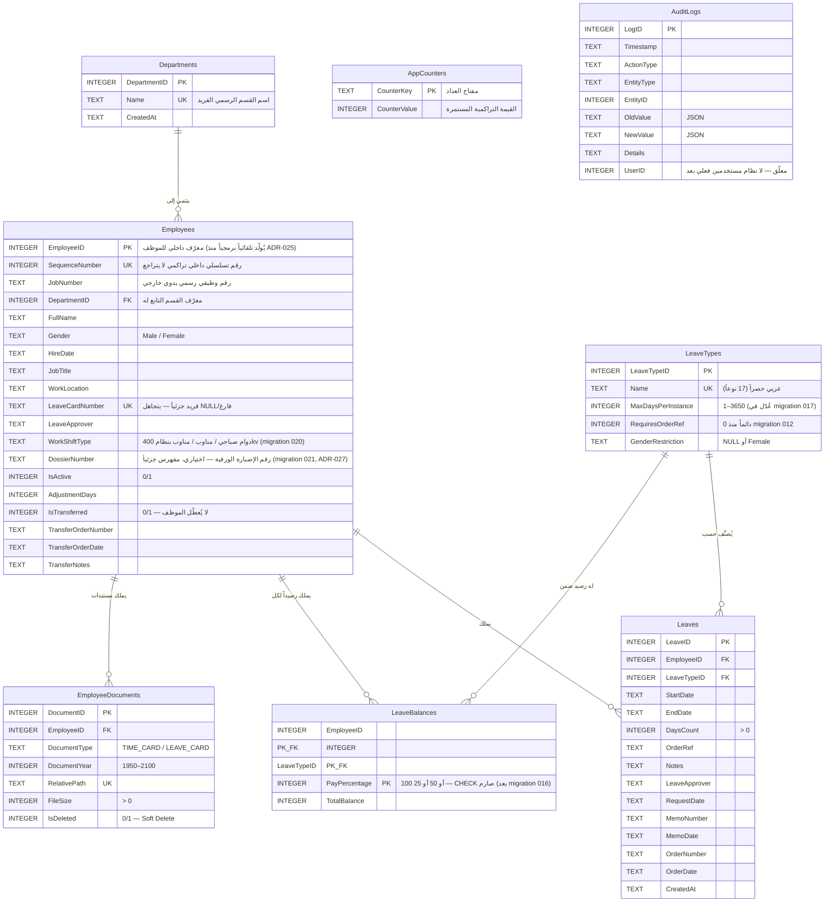

# DATA-MODEL.md — نظام إدارة الإجازات والمستندات (Holidays)

> **حالة الوثيقة:** الشكل النهائي الفعلي لقاعدة البيانات بعد تطبيق كل ملفات الترحيل (`001` إلى `024`) بالتسلسل — مُستخرَج مباشرة من ملفات SQL الفعلية، وليس افتراضاً.
> المرجع الوحيد الموثوق دائماً هو مجلد `src/main/migrations/`. عند إضافة ترحيل جديد مستقبلاً، **حدِّث هذا الملف في نفس الالتزام (Commit)**.

---

## 1. مخطط العلاقات (ERD)



---

## 2. الجداول بالتفصيل

### 2.1 `Employees` — سجل الموظفين

| العمود | النوع | القيد | الغرض |
|---|---|---|---|
| `EmployeeID` | INTEGER | **PRIMARY KEY** | معرّف داخلي للموظف، **يُولَّد تلقائياً برمجياً منذ ADR-025** (`MAX(EmployeeID)+1` داخل معاملة ذرية في `EmployeeService.js`) — لم يعد قابلاً للإدخال اليدوي من الواجهة. لا تعديل في تعريف العمود نفسه (بلا `AUTOINCREMENT`، بلا Migration). |
| `SequenceNumber` | INTEGER | **UNIQUE NOT NULL** | **رقم تسلسلي داخلي تصاعدي تراكمي مستمر** (1, 2, 3...) يُدار عبر جدول `AppCounters` ويستحيل تكراره أو تراجعه حتى عند حذف آخر موظف (أُضيف في `017` ومحمي بـ `AppCounters`). |
| `JobNumber` | TEXT | اختياري | **الرقم الوظيفي الرسمي الخارجي** الصادر من الوزارة/الدائرة، يقبل نصوصاً وأرقاماً وأصفاراً بادئة (أُضيف في `017` لفصل الرقم الوظيفي عن التسلسل الداخلي). |
| `DepartmentID` | INTEGER | `FOREIGN KEY REFERENCES Departments(DepartmentID)` | معرّف القسم الذي ينتمي له الموظف (أُضيف في `017`). يُستعلم عنه باسمه المستعار `DepartmentName` في كافة التقارير. |
| `FullName` | TEXT | `NOT NULL`, غير فارغ بعد التقليم | |
| `Gender` | TEXT | `CHECK IN ('Male','Female')` | يُستخدَم من محفز `trg_prevent_female_leave_for_male` |
| `HireDate` | TEXT | تنسيق `____-__-__` (ISO-8601) | |
| `JobTitle` | TEXT | `NOT NULL` | |
| `WorkLocation` | TEXT | اختياري | أُضيف في `002` |
| `LeaveCardNumber` | TEXT | **فريد جزئياً** (`idx_employees_leave_card_number`) — يتجاهل `NULL`/فارغ | أُضيف في `002` |
| `LeaveApprover` | TEXT | اختياري | أُضيف في `002` — قيمة افتراضية للموافق، تُستنسَخ لاحقاً إلى كل إجازة عبر `006` |
| `WorkShiftType` | TEXT | `NOT NULL DEFAULT 'دوام صباحي'`, `CHECK IN ('دوام صباحي','مناوب','مناوب بنظام 400kv')` | أُضيف في `020` — نوع دوام الموظف، قائمة مغلقة بثلاث قيم ثابتة (ADR-026) |
| `DossierNumber` | TEXT | اختياري (`NULL`) | أُضيف في `021` — رقم الإضبارة الورقية في الأرشيف الحكومي (ADR-027)، غير مقيد بالتفرد لاحتمال تشارك الإضبارة إدارياً، مفهرس جزئياً |
| `IsActive` | INTEGER | `CHECK IN (0,1)`, افتراضي `1` | يمنع تسجيل إجازة جديدة عند `0` عبر `trg_prevent_inactive_employee_leave` |
| `AdjustmentDays` | INTEGER | افتراضي `0` | أُضيف في `003` — تعديل يدوي على الرصيد (مثال: ترحيل من نظام سابق) |
| `IsTransferred` | INTEGER | `CHECK IN (0,1)`, افتراضي `0` | أُضيف في `015` — **لا يُعطّل الموظف** (`IsActive` يبقى `1`)؛ الموظف المنقول خارجياً يُستثنى من قوائم الإجازات النشطة، والتنبيهات المباشرة، وتقارير الأرصدة الحرجة، وإحصائيات التراكم السنوي، مع بقائه "نشطاً" رسمياً في دليل الموظفين |
| `TransferOrderNumber` / `TransferOrderDate` / `TransferNotes` | TEXT | اختياري | أُضيفت في `015` — توثيق أمر النقل الإداري |

**فهارس:** `idx_employees_sequence` (`SequenceNumber` فريد)، `idx_employees_dept` (`DepartmentID`)، `idx_employees_leave_card_number` (فريد جزئي)، `idx_employees_active_name` (`IsActive, FullName`)، `idx_employees_card` (`LeaveCardNumber`)، `idx_employees_is_transferred`، `idx_employees_dossier_number` (مفهرس جزئياً عند عدم كونه فارغاً).

### 2.2 `Departments` — سجل الأقسام (جديد منذ Migration 017)

| العمود | النوع | القيد | الغرض |
|---|---|---|---|
| `DepartmentID` | INTEGER | `PRIMARY KEY AUTOINCREMENT` | المعرّف الفريد للقسم. |
| `Name` | TEXT | `NOT NULL UNIQUE` | اسم القسم الرسمي المعتمد (فريد على مستوى النظام). |
| `CreatedAt` | TEXT | `DEFAULT (strftime('%Y-%m-%dT%H:%M:%fZ','now'))` | تاريخ ووقت إنشاء السجل. |

> **الأقسام الافتراضية (Seeded):** تم زرع القسمين الرسميين الافتراضيين المعتمدين عبر الترحيل `019`: (`قسم الشؤون الإدارية`، `قسم التشغيل`) وفق ADR-024 مع إزالة أي بذور غير معتمدة. القسم محمي من الحذف في حال ارتباطه بموظفين نشطين أو منقولين (قيد `ON DELETE RESTRICT`).

### 2.3 `LeaveTypes` — كتالوج أنواع الإجازات

| العمود | النوع | القيد |
|---|---|---|
| `LeaveTypeID` | INTEGER | `PRIMARY KEY AUTOINCREMENT` |
| `Name` | TEXT | `UNIQUE`, **عربي حصراً** (الأسماء الإنجليزية المكرّرة حُذفت نهائياً في `007`) |
| `MaxDaysPerInstance` | INTEGER | `CHECK > 0 AND <= 3650` (تمت ترقية السقف إلى 3650 يوماً في `017` لاستيعاب الإجازات متعددة السنوات حتى 5 سنوات) |
| `RequiresOrderRef` | INTEGER | `CHECK IN (0,1)` — **قيمته `0` لكل الأنواع دائماً منذ `012`** (الإلزامية أُزيلت نظامياً، العمود والمحفز `trg_enforce_order_ref` لا يزالان موجودين لكن معطَّلين فعلياً) |
| `GenderRestriction` | TEXT | `NULL` أو `'Female'` فقط |

**كتالوج الإجازات الفعلي الحالي (17 نوعاً معتمداً، بعد إضافة 6 أنواع جديدة في `017`):**

| الاسم | الحد الأقصى للطلب الواحد | تقييد جندري | ملاحظات |
|---|---|---|---|
| إجازة اعتيادية | 30 يوماً | لا | أساسية (تحتسب وفق أيام الخدمة 1/10) |
| إجازة مرضية | 30 يوماً | لا | أساسية (تخضع لنظام الشرائح الثلاث) |
| إجازة طارئة | 7 أيام | لا | |
| إجازة بدون راتب | 90 يوماً | لا | |
| إجازة دراسية | 30 يوماً | لا | |
| إجازة حجة | 30 يوماً | لا | |
| إجازة الأمومة | 72 يوماً | **نساء فقط** | |
| إجازة العدة | 130 يوماً | **نساء فقط** | |
| إجازة الرضاعة | 24 يوماً | **نساء فقط** | |
| دورة تدريبية | 365 يوماً | لا | |
| سبب آخر | 30 يوماً | لا | |
| إجازة المعين | 365 يوماً | لا | أُضيفت في `017` |
| إجازة السنة | 365 يوماً | لا | أُضيفت في `017` |
| إجازة السنتان | 730 يوماً | لا | أُضيفت في `017` |
| إجازة ثلاث سنوات | 1095 يوماً | لا | أُضيفت في `017` |
| إجازة أربع سنوات | 1460 يوماً | لا | أُضيفت في `017` |
| إجازة خمس سنوات | 1825 يوماً | لا | أُضيفت في `017` |

> ملاحظة: `MaxDaysPerInstance` هنا هو سقف الطلب الواحد على مستوى قاعدة البيانات، وهو **مستقل تماماً** عن منطق احتساب الرصيد الفعلي في `LeaveService.js` (مثال: الإجازة المرضية لها منطق توزيع هرمي بين شرائح `LeaveBalances` الثلاث بدل الاعتماد على هذا الحقل مباشرة — انظر القسم 2.4).

### 2.4 `LeaveBalances` — أرصدة الإجازات

```sql
PRIMARY KEY (EmployeeID, LeaveTypeID, PayPercentage)
PayPercentage INTEGER NOT NULL DEFAULT 100 CHECK(PayPercentage IN (100, 50, 25))
```

**هيكل الأرصدة والشرائح الثلاث (بعد N2 والترحيل 016):**
المفتاح الأساسي المركّب يتضمن `PayPercentage` كأحد أعمدة الهوية الثلاثية `(EmployeeID, LeaveTypeID, PayPercentage)` — أي أن كل موظف يملك **سطراً منفصلاً لكل نسبة راتب** ضمن نفس نوع الإجازة:
* **الإجازة الاعتيادية (`LeaveTypeID = 1`):** سطر واحد بنسبة `PayPercentage = 100` براتب كامل. يُحسب الرصيد المستحق تراكمياً منذ تاريخ التعيين بالاعتماد الصارم على تاريخ اليوم بتوقيت بغداد الرسمي (`Asia/Baghdad` عبر `Intl.DateTimeFormat`) لمنع أي انزياح بمقدار يوم واحد بين منتصف الليل والساعة 03:00 فجراً (ADR-031).
* **الإجازة المرضية (`LeaveTypeID = 2`):** موزعة على **ثلاث شرائح هرمية منفصلة** بموجب الترحيل `016`:
  1. `PayPercentage = 100` (براتب تام): سقفها الافتراضي 30 يوماً.
  2. `PayPercentage = 50` (بنصف راتب): سقفها الافتراضي 45 يوماً.
  3. `PayPercentage = 25` (بربع راتب): سقفها الافتراضي 45 يوماً.
  * **إجمالي الوعاء السنوي للإجازة المرضية:** 120 يوماً (30 + 45 + 45).

**تاريخ التعديل في Migration 016:**
كان القيد سابقاً محصوراً بقيمتين فقط `CHECK(PayPercentage IN (100, 50))`. ولأن SQLite لا يدعم تعديل قيود `CHECK` مباشرة عبر `ALTER TABLE`، قام الترحيل `016_add_sick_leave_25_percent_tier.sql` بإعادة بناء الجدول بطريقة ذرية:
1. إنشاء جدول بديل بالقيد الجديد `CHECK(PayPercentage IN (100, 50, 25))`.
2. نقل البيانات السابقة مع ترقية رصيد شريحة 100% للموظفين النشطين بيومين (من 28 إلى 30 يوماً).
3. إضافة الشريحة الثالثة (25%) برصيد 45 يوماً افتراضياً لكل موظف نشط مسجل لديه رصيد مرضي.
4. استبدال الجدول وتفعيل القيد الجديد بسلاسة دون فقدان أي بيانات.

### 2.5 `Leaves` — سجلات الإجازات الفردية

| العمود | ملاحظة |
|---|---|
| `LeaveID` | `PRIMARY KEY AUTOINCREMENT` |
| `EmployeeID`, `LeaveTypeID` | مفتاحان أجنبيان — `ON DELETE CASCADE` للموظف، `ON DELETE RESTRICT` لنوع الإجازة (لا يمكن حذف نوع إجازة له سجلات فعلية — تم تأكيده في `023`) |
| `StartDate`, `EndDate` | نص ISO-8601، مع `CHECK(EndDate >= StartDate)` **على مستوى قاعدة البيانات نفسها** — طبقة حماية ثانية إضافية فوق تحقق `_daysBetween` في JS |
| `DaysCount` | `CHECK > 0` — مخزَّن صراحة (ليس محسوباً وقت القراءة) |
| `LeaveLocation` | أُضيف في `024` — حقل نصي اختياري لتوثيق مكان قضاء الإجازة (داخل أو خارج القطر) |
| `OrderRef` | من `001` — إلزاميته مُعطَّلة فعلياً منذ `012` |
| `LeaveApprover` | أُضيف `006`، مع Backfill تلقائي للسجلات التاريخية من `Employees.LeaveApprover` وقت الترحيل |
| `RequestDate`, `MemoNumber`, `MemoDate`, `OrderNumber`, `OrderDate` | أُضيفت دفعة واحدة في `009` — توثيق إداري كامل (تاريخ الطلب، رقم/تاريخ المذكرة، رقم/تاريخ الأمر) |
| `CreatedAt` | `DEFAULT (strftime('%Y-%m-%dT%H:%M:%fZ','now'))` |

> **ملاحظة تداخل الإجازات (Migration 018):** أزال الترحيل `018` قيد التفرد القديم `UNIQUE(EmployeeID, LeaveTypeID, StartDate, EndDate)` للسماح بتسجيل الإجازات المتداخلة دون حدوث خطأ برمجي في قاعدة البيانات. وتتم إدارة تأكيد التداخل عبر خيار تطبيقي في واجهة المستخدم (`confirmOverlap`) دون الحاجة لحقل إضافي في الجدول.

**فهارس:** `idx_leaves_dates` (`StartDate, EndDate`)، `idx_leaves_emp_type` (`EmployeeID, LeaveTypeID`)، `idx_leaves_end_start` (`EndDate, StartDate` — لفرز الإجازات النشطة حسب تاريخ العودة).

### 2.6 `EmployeeDocuments` — مستندات الموظفين (بطاقات الدوام/الإجازات)

أُنشئ بالكامل في `013`. `RelativePath` **فريد** ويمثّل مسار الملف نسبياً داخل جذر التخزين (وليس مساراً مطلقاً) — هذا هو العمود الذي يمر عبر تحقق احتواء المسار في `DocumentStorageService.js` قبل أي وصول فعلي للقرص (انظر `ARCHITECTURE.md` القسم 7). `IsDeleted` يطبّق **حذفاً ناعماً (Soft Delete)** — الملف الفيزيائي والسجل يبقيان موجودين مع علامة، لا حذف فعلي فوري، مما يسمح باسترجاع أو تنظيف دوري لاحق (`document:purgeDeleted`).

### 2.7 `AppCounters` — العدادات النظامية المستمرة (جديد)

| العمود | النوع | القيد | الغرض |
|---|---|---|---|
| `CounterKey` | TEXT | `PRIMARY KEY` | المفتاح المعرّف للعداد (مثل: `'next_employee_sequence'` للتسلسل الداخلي، أو `'next_employee_id'` لتوليد المعرّف التقني الداخلي `EmployeeID` تلقائياً — **مختلف** عن حقل `JobNumber` الذي يُدخله المستخدم يدوياً). |
| `CounterValue` | INTEGER | `NOT NULL DEFAULT 1` | القيمة العددية الحالية للعداد. |

> **وظيفة حاسمة (Monotonic Persistence):** يُستخدم هذا الجدول لضمان ثبات التسلسل التصاعدي المستمر للموظفين `SequenceNumber` (ADR-020)، وكذلك توليد المعرّف الرئيسي التلقائي `EmployeeID` برمجياً وبشكل تصاعدي غير متراجع (ADR-025 والترحيل 022). عند إضافة موظف جديد، يُقرأ العداد ويُرفع بقيمة 1 ويُحفظ فوراً داخل نفس المعاملة الذرية، ولا ينقص أبداً عند حذف أي موظف لمنع تكرار المعرّفات نهائياً. تم إنشاء الجدول رسميّاً عبر الترحيل `022_create_app_counters_table.sql`.

### 2.8 `AuditLogs` — سجل التدقيق (النشط حالياً)

أُنشئ في `008` ليحل محل جدول `AuditLog` الأقدم (القادم من `001`) الذي **حُذف نهائياً في `011`** مع محفزاته (`trg_audit_leave_insert`, `trg_audit_leave_delete`). البنية الجديدة أغنى بكثير: `EntityType`/`EntityID` لتحديد الكيان المتأثر بدقة، `OldValue`/`NewValue` كلقطتي JSON قبل/بعد، `Details` كملخص عربي مقروء للبشر. عمود `UserID` أُضيف في `014` **تحضيراً** لنظام مستخدمين/مصادقة مستقبلي، لكنه غير مفعَّل أو مُلزَم حالياً (لا جدول `Users` موجود بعد — القيمة تبقى `NULL` عملياً في كل السجلات الحالية).

### 2.9 جداول مساعدة وإدارة اتصال البيانات (Internal / System & Connection Safety)

| الجدول | الغرض | ملاحظة |
|---|---|---|
| `_Migrations` | تتبّع ملفات الترحيل المنفَّذة (`id` PK AUTOINCREMENT, `name` TEXT UNIQUE NOT NULL, `executedAt` TEXT NOT NULL) | تُنشأ تلقائياً برمجياً داخل `database.js` عند الإقلاع وتُستخدم كآلية تتبع Idempotent تضمن تشغيل كل ملف من `001` إلى `024` مرة واحدة فقط داخل معاملة ذرية موحدة |
| `_AppSettings` | تخزين إعدادات النظام بنمط Key-Value (`Key` PK, `Value`, `UpdatedAt`) | من `008` — تُستخدَم لمسار تخزين المستندات المخصَّص وإعدادات أخرى قابلة للتغيير من الواجهة |
| `_NotificationLog` | منع تكرار إشعار الإجازات اليومي لنفس اليوم (`notificationType`, `sentDate`, `itemCount`) | من `004` |

> **إدارة اتصال قاعدة البيانات وإتاحة المرجع (`getDb` - ADR-031):** يُتيح موديول `src/main/database.js` دالة `getDb()` لتوفير وصول مباشر وآمن لمرجع قاعدة البيانات النشط للخدمات وشبكة أمان المعالجة الرئيسية (`uncaughtException` / `unhandledRejection`). كما تم تحصين دالة `db.close()` بكتلة `try/finally` لضمان إغلاق الاتصال وتفريغ أقفال WAL و SHM وتصفير المرجع دائماً عند أي إغلاق طارئ أو توقف للنظام.

---

## 3. القواعد المفروضة على مستوى قاعدة البيانات (وليس JS فقط)

هذا القسم مهم تحديداً لأنه يوضّح أي قواعد عمل **لا يمكن تجاوزها حتى من مسار كود قديم أو خطأ برمجي في JS** — لأنها مفروضة بواسطة محرك SQLite نفسه:

| القاعدة | الآلية | الملف/الموضع |
|---|---|---|
| لا يجوز منح إجازة نسائية حصراً لموظف ذكر | `TRIGGER trg_prevent_female_leave_for_male` (`BEFORE INSERT ON Leaves`) | `001` |
| لا يجوز تسجيل إجازة لموظف غير نشط | `TRIGGER trg_prevent_inactive_employee_leave` (`BEFORE INSERT ON Leaves`) | `001` |
| تاريخ النهاية يجب ألا يسبق تاريخ البداية | `CHECK(EndDate >= StartDate)` على جدول `Leaves` | `001` |
| نسبة راتب الإجازة محصورة بـ 100% أو 50% أو 25% | `CHECK(PayPercentage IN (100, 50, 25))` على `LeaveBalances` | `001`، عُدِّل في `016` |
| رقم كرت الإجازة فريد لكل موظف (عند وجوده) | فهرس فريد جزئي `idx_employees_leave_card_number` | `002` |
| رقم التسلسل الداخلي فريد وغير مكرر | `UNIQUE` على `Employees.SequenceNumber` مع جدول `AppCounters` | `017` / `AppCounters` |
| اسم القسم فريد ولا يتكرر | `UNIQUE` على `Departments.Name` | `017` |
| مسار المستند فريد | `UNIQUE` على `EmployeeDocuments.RelativePath` | `013` |
| حذف موظف يحذف تلقائياً كل إجازاته وأرصدته ومستنداته | `ON DELETE CASCADE` من `Leaves`/`LeaveBalances`/`EmployeeDocuments` نحو `Employees` | `001` / `013` / `017` |
| لا يجوز حذف نوع إجازة له سجلات فعلية | `ON DELETE RESTRICT` من `Leaves` نحو `LeaveTypes` | `001` و `023` |
| لا يجوز حذف قسم مرتبط بموظفين | فحص مرجعي ومنطقي صارم في `DepartmentService` قبل الحذف (`ON DELETE RESTRICT`) | `017` |

---

## 4. سجل تطوّر المخطط (Migration History)

| # | الملف | التغيير الجوهري |
|---|---|---|
| 001 | `initial_schema` | إنشاء الجداول الخمسة الأساسية + 5 محفزات + بذرة 11 نوع إجازة |
| 002 | `add_employee_fields` | `WorkLocation`, `LeaveCardNumber` (+فهرس فريد جزئي), `LeaveApprover` |
| 003 | `add_adjustment_days` | `AdjustmentDays` على `Employees` (لقواعد بيانات قديمة سابقة لهذا الترحيل) |
| 004 | `create_notification_log` | جدول `_NotificationLog` |
| 005 | `performance_indexes` | 3 فهارس أداء أساسية |
| 006 | `add_leave_approver_to_leaves` | `LeaveApprover` على `Leaves` + Backfill تاريخي |
| 007 | `cleanup_leave_types` | حذف أنواع إجازة إنجليزية مكرّرة، إعادة ربط السجلات القديمة بالاسم العربي المعتمد |
| 008 | `create_audit_and_settings` | جدولا `AuditLogs` (الحديث) و`_AppSettings` |
| 009 | `add_leave_order_and_memo_fields` | 5 أعمدة توثيق إداري على `Leaves` |
| 010 | `additional_indexes` | فهرسان إضافيان (فرز الإجازات النشطة، بحث كرت الإجازة) |
| 011 | `cleanup_legacy_audit` | **حذف** جدول `AuditLog` القديم ومحفزاته نهائياً |
| 012 | `remove_order_ref_requirement` | تصفير `RequiresOrderRef` لكل الأنواع (تعطيل فعلي لإلزامية رقم الأمر) |
| 013 | `create_employee_documents` | جدول `EmployeeDocuments` الكامل + فهرسان |
| 014 | `prepare_audit_users` | `UserID` على `AuditLogs` (تحضير لمستقبل غير مفعَّل بعد) |
| 015 | `add_employee_transfer_fields` | 4 أعمدة نقل خارجي على `Employees` + فهرس |
| 016 | `add_sick_leave_25_percent_tier` | إعادة بناء جدول `LeaveBalances` لتعديل قيد الفحص إلى `CHECK(PayPercentage IN (100, 50, 25))`، ورفع سقف الشريحة الأولى إلى 30 يوماً براتب كامل، وإضافة الشريحة الثالثة (25% — ربع راتب) بوعاء 45 يوماً ليتطابق النظام مع نظام الخدمة المدنية (إجمالي 120 يوماً) |
| 017 | `add_departments_sequence_and_leave_types` | إنشاء جدول `Departments`، وتعديل `Employees` لإضافة `DepartmentID` و `SequenceNumber` و `JobNumber`، وترقية سقف الإجازات إلى 3650 يوماً مع إضافة إجازة المعين وإجازات السنوات (1 إلى 5 سنوات) |
| 018 | `allow_overlapping_leaves_and_remove_duplicate_unique` | إعادة بناء جدول `Leaves` لإلغاء قيد التفرد القديم `UNIQUE(EmployeeID, LeaveTypeID, StartDate, EndDate)` للسماح بتسجيل الإجازات المتداخلة وإدارتها عبر التطبيق |
| 019 | `seed_default_departments` | زرع القسمين الرسميين الافتراضيين المعتمدين (`قسم الشؤون الإدارية` و `قسم التشغيل`) وحذف أي بذور غير معتمدة وفق ADR-024 |
| 020 | `add_work_shift_type_to_employees` | إضافة عمود `WorkShiftType` إلى `Employees` بقيد `CHECK` لثلاث قيم ثابتة (ADR-026) |
| 021 | `add_dossier_number_to_employees` | إضافة عمود `DossierNumber` (رقم الإضبارة) إلى `Employees` مع فهرس جزئي لتسريع البحث (ADR-027) ومنع تكراره بين الموظفين النشطين برمجياً (ADR-029) |
| 022 | `create_app_counters_table` | إنشاء جدول `AppCounters` للعدادات النظامية المستمرة وزرع قيمة البداية لـ `next_employee_id` لحساب `MAX(EmployeeID)+1` لدعم التثبيت النظيف ومنع تكرار المعرّفات (ADR-020, ADR-025) |
| 023 | `set_leaves_on_delete_restrict` | تثبيت قيد `ON DELETE RESTRICT` على `Leaves.LeaveTypeID` لضمان حماية أنواع الإجازات من الحذف عند ارتباطها بسجلات فعلية |
| 024 | `add_leave_location_to_leaves` | إضافة عمود `LeaveLocation` (مكان الإجازة — اختياري) إلى جدول `Leaves` لتوثيق مكان قضاء الإجازة (داخل/خارج القطر) |

**قاعدة ذهبية عند إضافة أي ترحيل جديد مستقبلاً:** أضف سطراً هنا في نفس الالتزام (Commit)، وحدِّث القسم المقابل من هذه الوثيقة (الجدول المتأثر) — لضمان بقاء نموذج البيانات مطابقاً بنسبة 100% للواقع الفعلي.

---

*آخر تحديث: 18 أيلول 2026، يشمل الترحيلات الكاملة حتى `024_add_leave_location_to_leaves.sql` ودعم إدارة أنواع الإجازات ومكان الإجازة.*

